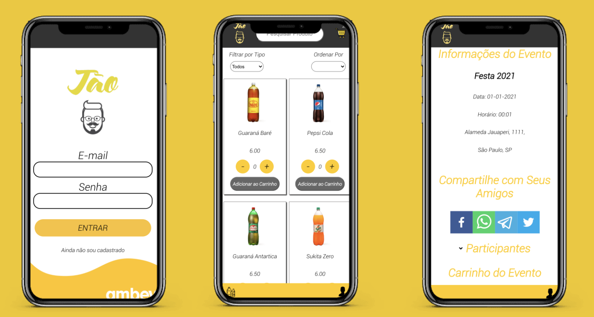

# App Jão

O App Jão é uma aplicação web desenvolvida pelos alunos da turma 03 do curso de Desenvolvimento de Software da Trybe, composto por Fabiano, Gustavo e Letícia.

Essa aplicação é fruto do Ambev Innovation Game 2 e visa criar um novo canal de venda para produtos não alcóolicos com foco em sustentabilidade e conveniência.

Nossa proposta tem o objetivo de agregar renda e valor a linha dos produtos não alcoólicos oferecendo maior conveniência para os usuários, atraindo consumidores, integração com usário, mercado e entregadores e principalmente trackeamento do consumo dos usuários.

Para visualizar o projeto: lcdlima.github.io/aig-grupo5

# Features do App:

- Tela de Login:
-- Verifica se o usuário está cadastrado e se a senha é a mesma do cadastro
-- Permite que seja feito o cadastro de um novo usuário

- Cadastro:
-- São três telas separadas para cadastro de dados de acesso, endereço e dados do cartão de crédito.

- Tela Principal
  -- Permite escolher se a compra será individual ou em grupo
  
- Tela de Perfil
 -- Mostra as 5 últimas compras do usuário
-- Mostra os eventos que o usuário está participando
-- Mostra o total de dinheiro economizado com a devolução das embalagens
-- Mostra o total de plástico que foi deixado de ser produzido

- Tela Principal de Produtos:
 --Lista de produtos e detalhes
--Produtos por categoria
--Link para acessar detalhes do produto
--Pesquisa de produto por nome
--Opção de adicionar produto ao carrinho
--Botões de aumentar e diminuir quantidade de um produto no Carrinho
--Ordenação por ordem alfabética / preço
--Carrinho mostrando a quantidade de produtos adicionadas

- Tela de detalhes do produto:
--Detalhes específicos do produto (preço, volume…)
--Botão de adicionar mais produtos ao carrinho
--Carrinho mostrando a quantidade de produtos adicionadas

- Tela de Carrinho
--Mostra todos os produtos adicionados de forma agrupada, além de mostrar o valor final de cada produto adicionado
--Opção de excluir um produto do carrinho
--Opção de aumentar ou diminuir o numero de um produto do carrinho
--Opção de retornar embalagens por tipo de embalagem
--Opção de retirar o produto ou solicitar o delivery
--Mostra o valor da soma dos produtos, valor do desconto com o retorno do produto, o valor do frete, e o total final
--Mostra mensagem de aviso para compras de valor negativo impedindo o avanço da compra
--Botão para finalizar pedido

- Tela de checkout delivery
--Mostra o valor a pagar
--Inclusão dos dados de pagamento
--Botão que preenche os campos com os dados do cartão do usuário cadastrado
--Inclusão dos dados de endereço de entrega
--Botão que preenche os campos com os dados de endereço do usuário cadastrado
--Botão que leva a tela de confirmação

- Tela de checkout retirada
--Mostra o valor a pagar
--Inclusão dos dados de pagamento
--Botão que preenche os campos com os dados do cartão do usuário cadastrado
--Botão que leva a tela de confirmação

- Tela de Confirmação
--Mostra o valor economizado (se economizado)
--Mostra o total de plástico reduzido
--Gera um qr code que será o voucher para retirada do produto
--Ao atingir 1kg de plástico reduzido é mostrado uma mensagem oferecendo um produto de brinde que o usuário ainda não tenha consumido

- Header
--Logo que é um link para tela de compra Individual ou em Grupo

- Footer
--Botão esquerdo leva para a tela principal de produtos
--Botão Direito leva para a tela de perfil do usuário

- Tela de Escolher Evento
--Permite logar em um evento cadastrado com o id e senha do evento que serão geradas aleatoriamente
--Permite criar um novo evento

- Tela de Cadastro de evento 
-- Permite cadastrar um novo evento com os dados de endereço, data e horário

- Tela de Confirmação
-- Mostra o evento criado bem como as regras de realização do evento permitindo escolher aceitar ou não as regras

- Tela do Evento
-- Mostras as informações do evento
--Permite compartilhar o evento pelo whatsapp, facebook, telegram e Twitter
--Permite adicionar produtos ao evento a partir do redirecionamento para a tela principal de produtos
--Permite excluir o evento se for o criador do evento
--Permite visualizar os participantes

- Tela de checkout da compra em grupo
-- Permite adicionar e exlcuir mais produtos
--Permite visualizar outros produtos que já foram comprados para o evento
--Permite finzalizar a compra e encaminha para a tela de confirmaçãp

### Tecnologias Empegadas

Para essa aplicação utilizamos:
- React
- Redux
- Componentes externos: 
-- google-maps-react
-- react-share

### Instalação
$ npm install

